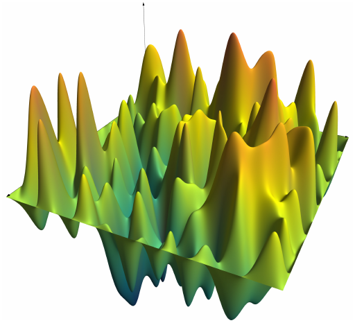
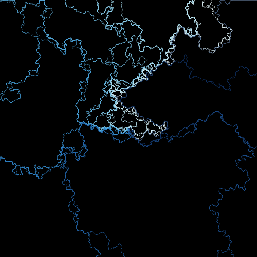
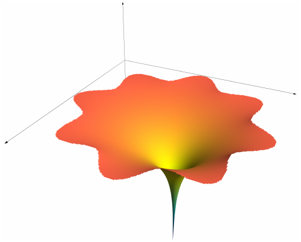

# FractionalGaussianFields

Provides tools for simulating Gaussian free fields and other fractional Gaussian fields

```julia
using AsyPlots, FractionalGaussianFields
plot(zeroboundary(torus_gff(20)))
```



```julia
using AsyPlots, FractionalGaussianFields
n = 250
h = zeroboundary(torus_gff(n))
κ = 3
χ = 2/sqrt(κ) - sqrt(κ)/2
z0 = (n+1)/2 + im*(n+1)/2
L = 40
C = Colors.colormap("Blues",L)
cairo() # the Cairo backend to AsyPlots is faster
Plot([Path(flowline(h, z0, χ, θ),color=c) for (θ,c) in
		       zip(range(0,2π,length=L),C)],bgcolor="Black",border=0)
```



```julia
using AsyPlots, FractionalGaussianFields
P = [(1+cos(8θ)/8)*cis(θ) for θ=range(0,2π,length=500)]
loop = Path(P).points
n = 200
Δvals(i,j) = (i,j) == (120,120) ? 1 : 0
bvals(i,j) = 0 
G = domainapprox(loop,n)
laplacesurface(G,Δvals,bvals)
```

